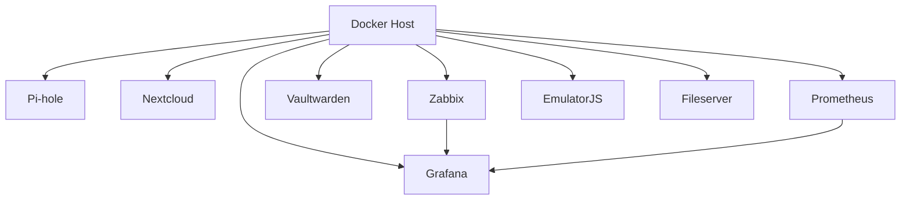

# Home Lab Docker Setup

Este repositório contém a configuração para um ambiente de **Home Lab** utilizando **Docker**. O objetivo é fornecer uma solução prática para rodar diversos serviços em containers Docker de maneira simples e organizada.

## Serviços

Este repositório configura os seguintes serviços:

- **Pi-hole**: Bloqueio de anúncios e rastreadores.
- **Nextcloud**: Armazenamento em nuvem pessoal.
- **Zabbix**: Monitoramento de rede e servidores.
- **Vaultwarden**: Gerenciador de senhas auto-hospedado.
- **Prometheus**: Monitoramento e coleta de métricas.
- **EmulatorJS**: Emulador de jogos retro.
- **Fileserver**: Servidor de arquivos simples.
- **Grafana**: Interface gráfica para monitoramento, integrado ao Zabbix.

## Estrutura do Repositório

O repositório está organizado da seguinte forma:

- **emulatorjs**: Configuração do EmulatorJS para emulação de jogos retro.
- **fileserver**: Configuração para rodar um servidor de arquivos simples.
- **monitoramento**: Contém o Zabbix, Prometheus e Grafana para monitoramento de rede e servidores.
- **nextcloud**: Configuração para rodar o Nextcloud, uma plataforma de armazenamento em nuvem pessoal.
- **pihole**: Configuração do Pi-hole para bloqueio de anúncios e rastreadores.
- **prometheus**: Configuração do Prometheus para coleta e monitoramento de métricas.
- **vaultwarden**: Configuração do Vaultwarden, um gerenciador de senhas auto-hospedado.

## Requisitos

- Docker e Docker Compose instalados.
- Certificados SSL válidos para o Vaultwarden (caso você vá usar HTTPS).

## Instruções de Uso

### Passo 1: Clonar o Repositório

Clone o repositório para sua máquina local:

```bash
git clone https://github.com/heltoncarneiro/home-lab-docker.git
cd home-lab-docker
```

### Passo 2: Configuração dos Arquivos `.env`

Cada serviço pode ter variáveis de ambiente configuráveis. Antes de rodar os containers, você precisará criar um arquivo `.env` para cada serviço. Abaixo estão exemplos das variáveis para os principais serviços.

#### **Zabbix** (`monitoramento/zabbix.env`):

```env
POSTGRES_DB=zabbix
POSTGRES_USER=zabbix
POSTGRES_PASSWORD=sua_senha_forte  # Altere para uma senha segura
PHP_TZ=America/Sao_Paulo
```

#### **Nextcloud** (`nextcloud/nextcloud.env`):

```env
MYSQL_ROOT_PASSWORD=sua_senha_forte  # Crie uma senha segura aqui
MYSQL_PASSWORD=1608
MYSQL_DATABASE=nextcloud
MYSQL_USER=nextcloud
```

#### **Pi-hole** (`pihole/pihole.env`):

```env
FTLCONF_webserver_api_password=sua_senha_forte  # Altere para uma senha segura
```

### Passo 3: Subir os Containers com Docker Compose

Após configurar os arquivos `.env`, você pode rodar os containers usando o Docker Compose:

```bash
docker-compose up -d
```

O comando `-d` faz com que os containers sejam iniciados em segundo plano (detached mode).

### Passo 4: Acessando os Serviços

Após o Docker Compose iniciar os containers, você pode acessar os serviços pelas seguintes URLs (ajuste conforme sua rede local ou IP de acesso):

- **Pi-hole**: `http://localhost:8383`
- **Nextcloud**: `http://localhost:8181`
- **Vaultwarden**: `https://localhost:8282` (Certifique-se de configurar SSL corretamente)
- **Zabbix**: `http://localhost:8080`
- **Prometheus**: `http://localhost:9090`
- **EmulatorJS**: `http://localhost:8585`
- **Fileserver**: `http://localhost:8686`
- **Grafana**: `http://localhost:8484` (Integrado ao Zabbix)

### Passo 5: Parar e Remover os Containers

Se você quiser parar e remover os containers, execute:

```bash
docker-compose down
```

## Diagrama de Arquitetura

Aqui está o diagrama que mostra a arquitetura do seu **Home Lab Docker Setup**:



## Notas

- **Vaultwarden**: Caso esteja usando Vaultwarden com HTTPS, lembre-se de configurar os certificados SSL adequados nos arquivos `.crt` e `.key`.
- **Segurança**: Para todos os serviços, especialmente os que envolvem dados sensíveis como **Zabbix** e **Nextcloud**, é altamente recomendado o uso de senhas fortes. As senhas padrão nos exemplos são apenas ilustrativas e devem ser alteradas antes de usar em produção.
- **Backups**: Considere fazer backups regulares dos dados do Nextcloud e Zabbix, especialmente em ambientes de produção.

## Licença

Este projeto está licenciado sob a **MIT License**.
